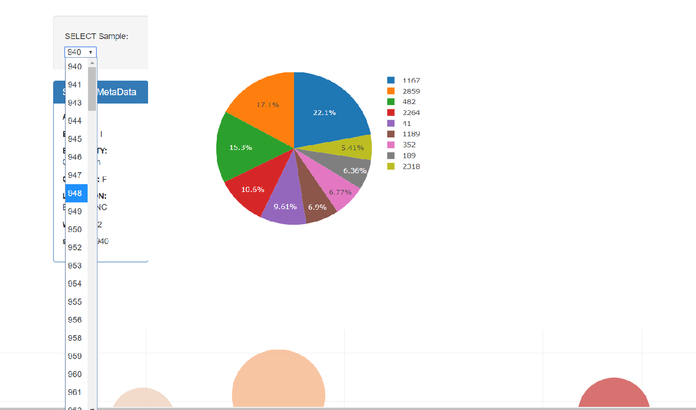
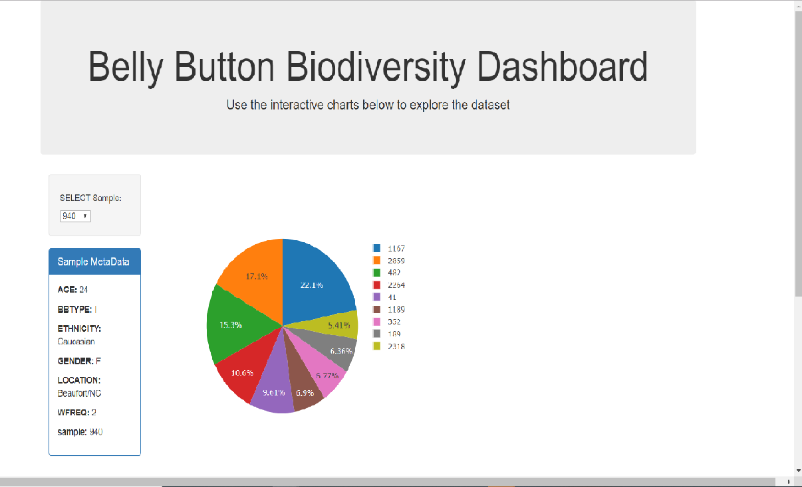
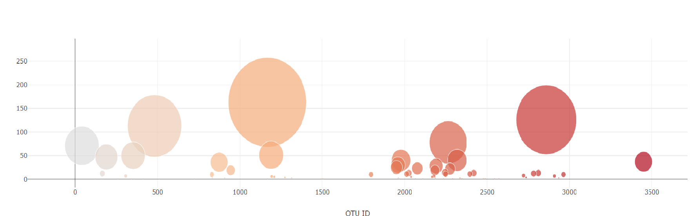

# Plotly : Belly Button Diversity

An interactive Dashboard using the [Belly Button Biodiversity DataSet](http://robdunnlab.com/projects/belly-button-biodiversity/). 

Dashboard created using Plotly-JS,Flask,HTML-CSS and deployed on Heroku.

Heroku app Link: https://bellybuttonmrun.herokuapp.com/

The drop-down selection filter creates pie-chart and a bubble chart for that sample value.

